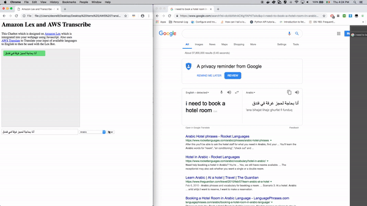

#How to use AWS Translate with AWS Lex

This Github will demonstrate how to use AWS Translate to allow for multi-Language use of AWS Lex

![alt text][architecture]

## Background 

[AWS Lex][1]is an AWS service which allows developers to create an build conservation chat bots. AWS Lex allows for easy to integrate SDK access - which allows for quick to deploy solutions to developing chat bots. 
In the backend Lex can be integrated with [AWS Lambda][2] to allow for access to other AWS Services and programmable functionality. 

[AWS Translate][3] is an AWS Service which allows for fast and high-quality language translation. With SDK access, Translate is a easy to use solution to allow for language support for a multiple of languages. 

## Getting Started

This GitHub works on the assumption that you have already created a Lex bot and configured the correct permissions within AWS Cognito and IAM. For a full setup(which the basis of the code is taken from) can be found [here][4]

The link above includes the bootstrap of the basic code for this example. However this GitHub includes all the code needed. From the [link][4] you will only be required to configure the ‘Set up Amazon Cognito’ and configure the permissions of which you need to include: 
AmazonLexRunBotsOnly 
TranslateReadOnly 

With the above IAM Permissions, when configured for the unauthenticated users will allow these users access to interact with a Lex bot and also interact with the Translate service. 

### Code 

The [HTML] and [Javascript] code uses the [AWS Javascript SDK][7]which in the code uses the browser script. For this no additional code is needed as the script src gathers the additional code from the online repo held in the script src tags. 

### Changes needed to be made in the code 

In the code, the following changes need to be made to configure the code to work with your Cognito pool and Lex bot: 
1.     backend.js -> include region and Identity Pool ID

2.     backend.js -> include the Lex Bot Name

Save and Run. 

## Authors

* **Dean O’Reilly** - *Architecture and additional code* - [Dean O’Reilly](https://github.com/PurpleBooth)
 

[architecture]: <image url> “Overview of Architecture“

[1]https://aws.amazon.com/lex/
[2]https://aws.amazon.com/lambda/
[3]https://aws.amazon.com/translate/
[4]https://aws.amazon.com/blogs/machine-learning/greetings-visitor-engage-your-web-users-with-amazon-lex/
[5]<html link>
[6]<JS link>
[7]https://aws.amazon.com/sdk-for-browser/